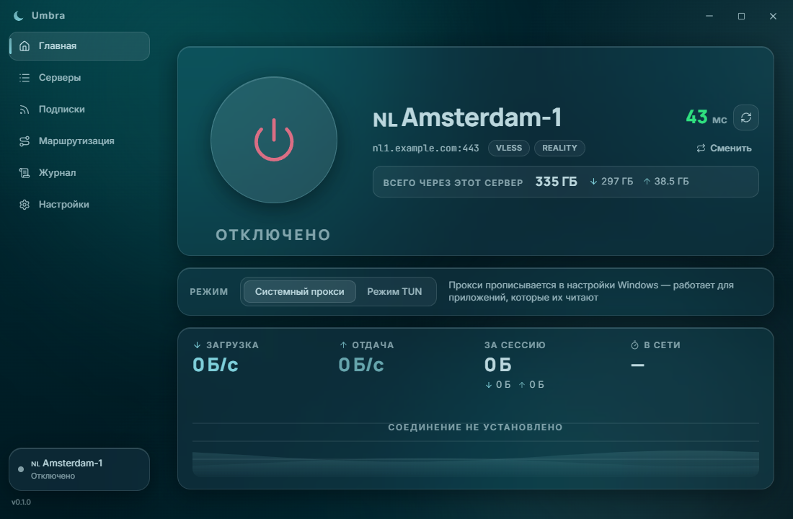
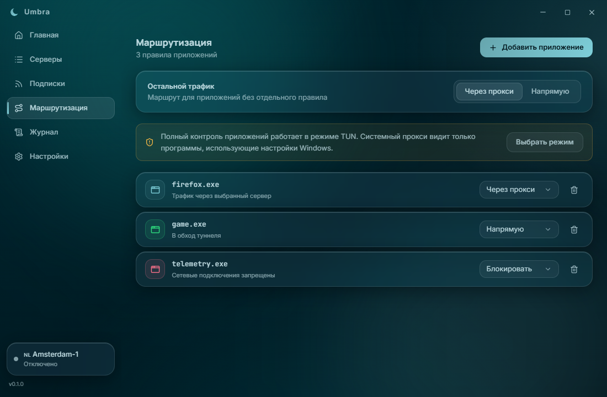

# Umbra

Современный Windows-клиент для sing-box: подписки, быстрый выбор серверов, системный прокси, TUN и маршрутизация приложений в одном аккуратном интерфейсе.

[](https://github.com/SagerNet/sing-box)
[](https://tauri.app/)
[](LICENSE)

[Скачать последнюю версию](../../releases/latest) · [Сообщить о проблеме](../../issues/new/choose) · [Политика приватности](docs/PRIVACY.ru.md)



## Возможности

- импорт подписок и отдельных `vless://`-ссылок;
- обновление подписок вручную или по расписанию;
- список серверов с флагами стран, поиском, избранным и проверкой задержки;
- системный прокси без прав администратора;
- TUN-режим для трафика всей системы;
- отдельные правила для приложений: через прокси, напрямую или блокировать;
- живые показатели скорости, трафика и журнал sing-box;
- восстановление системного прокси после аварийного завершения;
- автозапуск, сворачивание в трей, русский и английский интерфейс.



## Установка

На странице [последнего релиза](../../releases/latest) доступны два варианта:

- `Umbra_0.1.0_x64-setup.exe` — обычный установщик;
- `Umbra_0.1.0_windows_x64_portable.zip` — portable-версия, которую достаточно распаковать и запустить через `Umbra.exe`.

Требуется Windows 10/11 x64 и Microsoft Edge WebView2. В Windows 11 WebView2 уже установлен, а установщик Umbra при необходимости загрузит его автоматически.

Сборки пока не подписаны коммерческим сертификатом, поэтому SmartScreen может показать предупреждение. Проверяйте SHA-256 по файлу `SHA256SUMS.txt` из релиза.

## Быстрый старт

1. Откройте **Подписки** и добавьте ссылку от своего провайдера либо импортируйте `vless://`-ссылки.
2. На странице **Серверы** выберите узел и при желании проверьте задержку.
3. На главной странице выберите системный прокси или TUN и подключитесь.
4. Для разделения трафика откройте **Маршрутизация** и назначьте правила приложениям. Полный контроль процессов доступен в TUN-режиме.

> Серверы с транспортом xHTTP не импортируются: xHTTP относится к Xray и не поддерживается sing-box.

## Приватность

Umbra не отправляет телеметрию и хранит настройки локально в `%APPDATA%\com.umbra.proxy`. Ссылки подписок, идентификатор устройства и сгенерированные конфигурации не находятся в репозитории и не должны попадать в баг-репорты.

Подробности: [docs/PRIVACY.ru.md](docs/PRIVACY.ru.md).

## Сборка из исходников

Понадобятся Node.js 20+, Rust stable, инструменты сборки MSVC и WebView2. Кроме того, положите `sing-box.exe` версии `1.13.14` в `src-tauri/resources/`.

```powershell
npm ci
npm run build
cargo test --manifest-path src-tauri/Cargo.toml
npm run tauri build
```

В CI ядро загружается из официального релиза sing-box и проверяется по SHA-256 до сборки. Установщик появится в `src-tauri/target/release/bundle/nsis/`.

## Лицензия

Код Umbra распространяется по лицензии [MIT](LICENSE). В состав готовых сборок входит отдельный исполняемый файл [sing-box](https://github.com/SagerNet/sing-box), распространяемый авторами по GPL-3.0-or-later. Подробности перечислены в [THIRD_PARTY_NOTICES.md](THIRD_PARTY_NOTICES.md).
