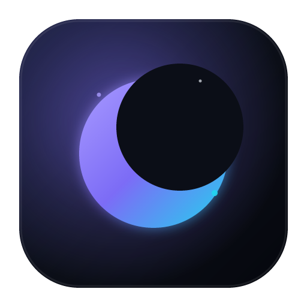

<div align="center">
  

  # Umbra

  **Современный Windows-клиент для sing-box**

  Подписки, быстрый выбор серверов, системный прокси, TUN и маршрутизация приложений — в одном аккуратном интерфейсе.

  [](https://github.com/wannasly/Umbra/actions/workflows/ci.yml)
  [](https://github.com/wannasly/Umbra/actions/workflows/secret-scan.yml)
  [](https://www.microsoft.com/windows)
  [](https://tauri.app/)
  [](https://github.com/SagerNet/sing-box)
  [](LICENSE)

  [Скачать](../../releases/latest) · [Документация](#быстрый-старт) · [Сообщить о проблеме](../../issues/new/choose) · [Приватность](docs/PRIVACY.ru.md)
</div>


## Что умеет Umbra

| | Возможность | Что это даёт |
|---|---|---|
| 🔗 | Подписки и VLESS | Импорт ссылок, ручное и автоматическое обновление |
| ⚡ | Умный выбор сервера | Поиск, избранное, группировка и проверка задержки |
| 🖥️ | Системный прокси | Подключение без прав администратора |
| 🛡️ | TUN-режим | Проксирование трафика всей системы |
| 🧭 | Маршрутизация приложений | Прокси, прямое соединение или блокировка для отдельных программ |
| 📊 | Живая статистика | Скорость, объём трафика и журнал sing-box |
| 🧯 | Безопасное восстановление | Возврат системного прокси после аварийного завершения |
| 🌍 | Удобство | Автозапуск, трей, русский и английский интерфейс |


## Установка

Скачайте нужный файл на странице [последнего релиза](../../releases/latest):

- `Umbra_<version>_x64-setup.exe` — обычный установщик;
- `Umbra_<version>_windows_x64_portable.zip` — portable-версия без установки.

Требуется **Windows 10/11 x64** и Microsoft Edge WebView2. В Windows 11 WebView2 уже установлен; установщик Umbra при необходимости загрузит его автоматически.

> [!NOTE]
> Сборки пока не подписаны коммерческим сертификатом, поэтому SmartScreen может показать предупреждение. Проверяйте SHA-256 по файлу `SHA256SUMS.txt` из того же релиза.

## Быстрый старт

1. В разделе **Подписки** добавьте ссылку своего провайдера или импортируйте отдельные `vless://`-ссылки.
2. На странице **Серверы** выберите узел и при желании проверьте задержку.
3. На главной странице выберите **Системный прокси** или **TUN** и нажмите кнопку подключения.
4. Для разделения трафика откройте **Маршрутизацию** и назначьте правила приложениям.

> [!IMPORTANT]
> xHTTP относится к экосистеме Xray и не поддерживается sing-box, поэтому такие серверы при импорте пропускаются.

## Приватность

Umbra не использует аналитику, рекламу или телеметрию. Настройки и данные подписок хранятся локально в `%APPDATA%\com.umbra.proxy`.

- ссылка подписки передаётся только указанному в ней серверу провайдера при обновлении;
- HWID отправляется провайдеру только при включённой пользователем поддержке HWID;
- `profiles.json`, `settings.json`, `generated.json`, `.env` и локальные логи исключены из Git;
- каждый push и pull request проверяется на секреты с помощью Gitleaks.

Подробнее: [политика приватности](docs/PRIVACY.ru.md) и [рекомендации по безопасности](SECURITY.md).

## Технологии

```text
React 19 + TypeScript + Tailwind CSS 4
                 │
              Tauri 2
                 │
               Rust
                 │
             sing-box
```

Интерфейс работает в системном WebView, а Rust-бэкенд отвечает за хранение профилей, управление системным прокси, запуск sing-box и локальный Clash API.

## Сборка из исходников

Понадобятся:

- Node.js 20+;
- Rust stable;
- MSVC Build Tools;
- Microsoft Edge WebView2;
- `sing-box.exe` версии `1.13.14` в `src-tauri/resources/`.

```powershell
npm ci
npm run build
cargo test --manifest-path src-tauri/Cargo.toml
npm run tauri build
```

В CI ядро загружается из официального релиза sing-box и проверяется по SHA-256 до сборки. Установщик создаётся в `src-tauri/target/release/bundle/nsis/`.

Дополнительные сценарии проверки описаны в [docs/TESTING.ru.md](docs/TESTING.ru.md).

## Лицензия

Исходный код Umbra распространяется по лицензии [MIT](LICENSE). Готовые сборки включают отдельный исполняемый файл [sing-box](https://github.com/SagerNet/sing-box), распространяемый его авторами по GPL-3.0-or-later. Подробности — в [THIRD_PARTY_NOTICES.md](THIRD_PARTY_NOTICES.md).
